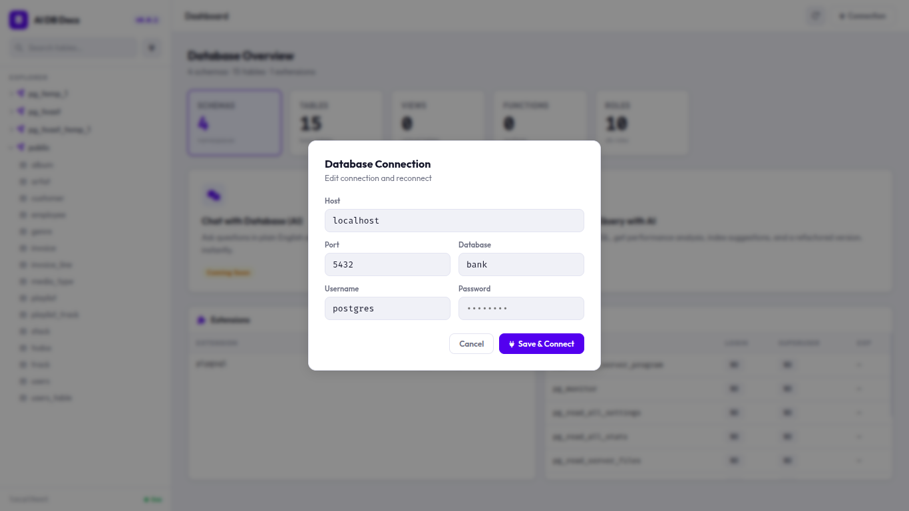
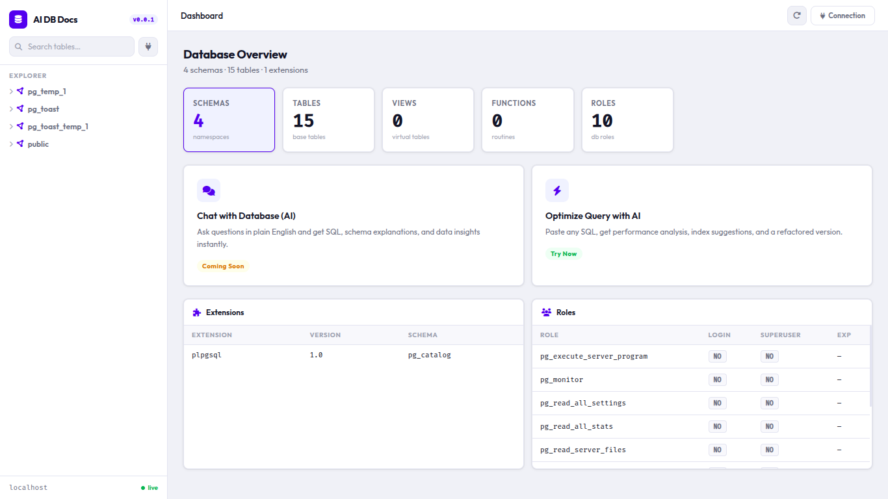
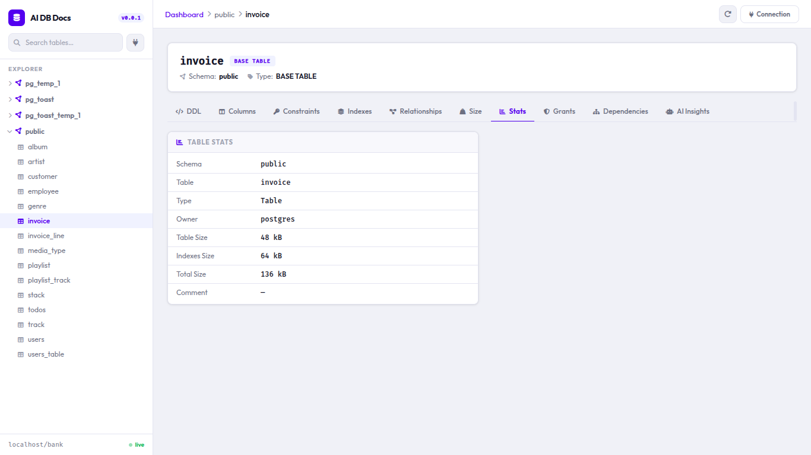

## Nova - AI DB Docs

A self-hosted web UI for exploring your PostgreSQL database — with an AI query optimizer baked in.

### What it does

You point it at a Postgres database and it gives you a browsable interface for everything you'd normally dig up by writing `information_schema` queries by hand: schemas, tables, columns, DDL, constraints, indexes, foreign key relationships, table sizes, stats, grants, dependencies, functions, enums, extensions, and roles.

On top of that, there's an AI-powered query optimizer. Paste any SQL query into the panel and it'll rewrite it for performance — better joins, smarter filtering, index-friendly patterns, the works. It uses an LLM under the hood (via Ollama) to return only the optimized query, no fluff.

A couple of features — "Chat with Database" and per-table AI Insights — are still in progress and marked as coming soon in the UI.

### Tech stack

- **Backend:** FastAPI + psycopg2
- **AI:** Ollama (`gpt-oss:120b`)
- **Frontend:** Vanilla JS, Jinja2 templates
- **Database:** PostgreSQL

### Getting started

You'll need Python 3.10+, a running PostgreSQL instance, and an Ollama Cloud API key.

**1. Clone and install dependencies**

```bash
pip install -r requirements.txt
```

**2. Set up your environment**

Create a `.env` file in the project root:

```env
DATABASE_NAME=your_db
DATABASE_USER=postgres
DATABASE_PASSWORD=your_password
DATABASE_HOST=localhost
DATABASE_PORT=5432

OLLAMA_CLOUD_API_KEY=your_ollama_key
```

**3. Run it**

```bash
uvicorn main:app --reload
```

Then open `http://localhost:8000` in your browser. The app will test the database connection on startup and refuse to run if it can't reach Postgres.

### API reference

The REST API is fully browsable at `/docs` (Swagger UI).

**Schema & table exploration**

| Method | Path                               | Description                  |
|--------|------------------------------------|------------------------------|
| GET    | `/schemas`                         | List all non-system schemas  |
| GET    | `/schemas/{schema}/tables`         | Tables and views in a schema |
| GET    | `/schemas/{schema}/tables/{table}` | Column definitions           |
| so on  | `and so on please check /docs`     | so on ...                    |


**AI**

| Method | Path | Description |
|--------|------|-------------|
| POST | `/chat` | Optimize a SQL query. Body: `{ "input_prompt": "SELECT ..." }` |

### How the query optimizer works

The `/chat` endpoint passes your SQL to `gpt-oss:120b` via Ollama with a tightly constrained system prompt — it's instructed to return *only* the optimized query, nothing else. The response is then converted from markdown to HTML before being sent back to the frontend, so code blocks render correctly in the UI.

### Screenshots:



