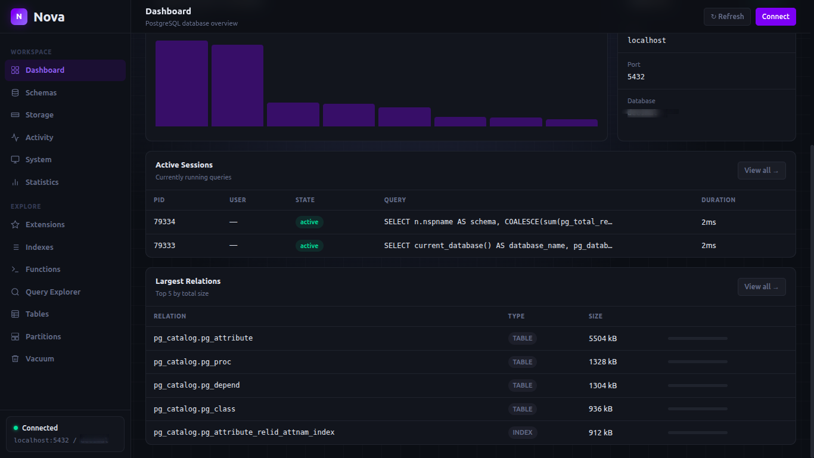
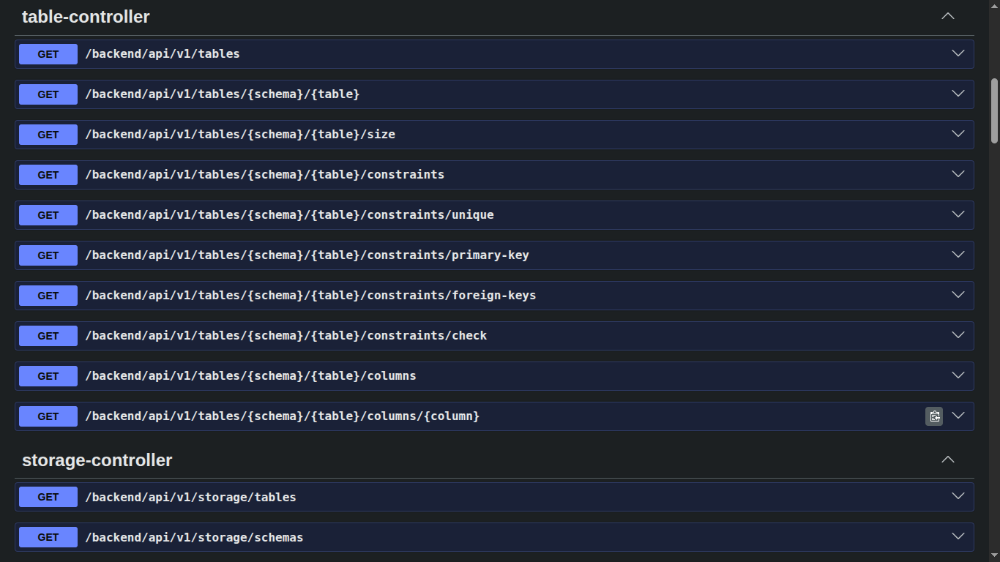

## Nova

A self-hosted PostgreSQL database viewer and monitoring tool with a web UI and a REST API.

### Overview

Nova is a Spring Boot application that connects to a PostgreSQL database and exposes a browser-based interface for inspecting schemas, tables, indexes, queries, storage, and live activity — without needing an external client like pgAdmin or DBeaver.

### Features

| Area | What you can do |
|---|---|
| **Schemas** | List schemas; browse tables, views, sequences, functions, and types per schema |
| **Tables** | List tables with pagination; inspect columns, size, and all constraint types (PK, FK, unique, check) |
| **Indexes** | List indexes; find unused, invalid, duplicate, and largest indexes; view per-table indexes |
| **Queries** | Browse `pg_stat_statements`; filter by duration/calls; view top, slow, frequent, I/O-heavy, CPU-heavy, and temp-spilling queries |
| **Activity** | Monitor `pg_stat_activity`; filter by state (active, idle, waiting); find long-running sessions by PID |
| **Statistics** | Table-level and database-level statistics via `pg_stat_user_tables` |
| **Storage** | Database, schema, table, and index storage breakdowns; largest relations |
| **Vacuum** | View vacuum status and per-table info; trigger `VACUUM` and `ANALYZE` via the API |
| **Extensions** | List installed and available extensions |
| **Functions** | Browse stored functions with source definitions |
| **Partitions** | List all partitions and partitions for a specific table |
| **Dynamic connect** | Switch the active database at runtime via `POST /connect` |

### Tech Stack

**Backend**
- **Java 17** · **Spring Boot 4.1.1** (Web MVC, JDBC, Validation)
- **PostgreSQL** driver + **HikariCP** connection pool
- **Springdoc OpenAPI 3** (Swagger UI)
- **Lombok**

**Frontend**
- **Thymeleaf** (server-side templating)
- **Tailwind CSS** (via CDN)
- **Vanilla JS**

### Getting Started

#### Prerequisites

- Java 17+
- Maven 3.x
- A running PostgreSQL instance

#### Configuration

Create a `.env` file in the project root (already git-ignored):

```properties
DATABASE_NAME=your_db
DATABASE_USER=your_user
DATABASE_PASSWORD=your_password
```

The datasource defaults in `application.properties` resolve these at startup:

```properties
spring.datasource.url=jdbc:postgresql://localhost:5432/${DATABASE_NAME}
spring.datasource.username=${DATABASE_USER}
spring.datasource.password=${DATABASE_PASSWORD}
```

#### Run

```bash
./mvnw spring-boot:run
```

The app starts on **http://localhost:8080**.  
Swagger UI is available at **http://localhost:8080/swagger-ui/index.html**.

#### Build

```bash
./mvnw clean package
java -jar target/nova-0.0.1.jar
```

### API

All REST endpoints are prefixed with `/backend/api/v1/`.

| Resource | Base path |
|---|---|
| Connection | `POST /connect` |
| Schemas | `/backend/api/v1/schemas` |
| Tables | `/backend/api/v1/tables` |
| Indexes | `/backend/api/v1/indexes` |
| Queries | `/backend/api/v1/queries` |
| Activity | `/backend/api/v1/activity` |
| Statistics | `/backend/api/v1/statistics` |
| Storage | `/backend/api/v1/storage` |
| Vacuum | `/backend/api/v1/vacuum` |
| Extensions | `/backend/api/v1/extensions` |
| Functions | `/backend/api/v1/functions` |
| Partitions | `/backend/api/v1/partitions` |

Full interactive docs at `http://localhost:8080/swagger-ui/index.html`.

#### Dynamic database switching

Send a `POST /connect` with a JSON body to point the application at a different PostgreSQL instance at runtime:

```json
{
  "host": "localhost",
  "port": 5432,
  "database": "my_other_db",
  "username": "postgres",
  "password": "secret"
}
```

The previous connection pool is closed and replaced atomically.

### Project Structure

```
src/main/java/com/ghulam/nova/
├── NovaApplication.java        # Entry point; bootstraps local DB on startup
├── config/                     # Swagger + request logging config
├── controller/                 # REST + Thymeleaf controllers
├── service/                    # Business logic & ConnectionService
├── repo/                       # SQL queries via NamedParameterJdbcTemplate
├── dtos/                       # Request/response records
├── exception/                  # Global exception handler
└── helper/                     # AppSetting utility
```

### Screenshot

